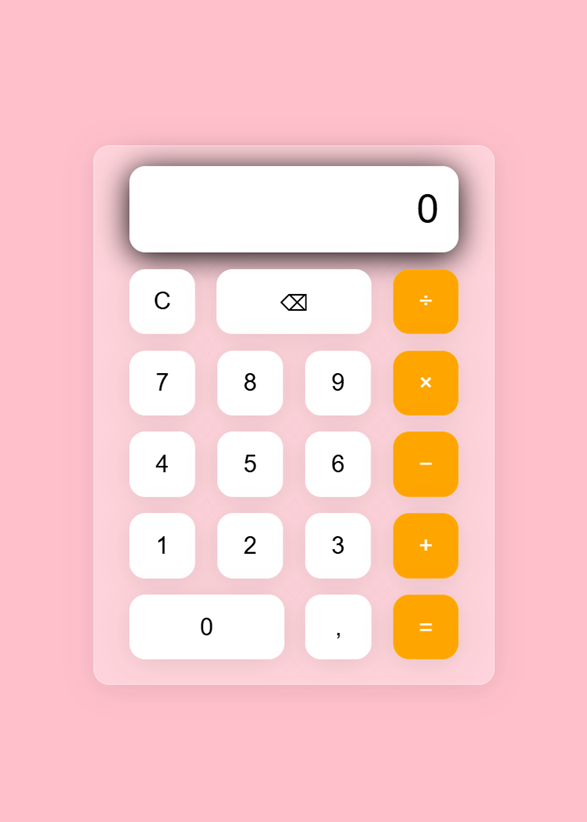

# 🧮 Calculator


Một ứng dụng **Calculator** được xây dựng bằng **HTML, CSS và JavaScript (Vanilla JS)**. Dự án mô phỏng máy tính cầm tay với giao diện hiện đại theo phong cách **Glassmorphism**, hỗ trợ các phép tính cơ bản và thao tác chỉnh sửa biểu thức.

## ✨ Tính năng

* ➕ Cộng
* ➖ Trừ
* ✖️ Nhân
* ➗ Chia
* 🔢 Hỗ trợ số thập phân
* 🧹 Xóa toàn bộ (`C`)
* ⌫ Xóa từng ký tự
* 📱 Giao diện đơn giản, dễ sử dụng
* ✨ Hiệu ứng Glassmorphism

## 🛠️ Công nghệ sử dụng

* **HTML5** – Xây dựng cấu trúc giao diện
* **CSS3** – Thiết kế giao diện và hiệu ứng
* **JavaScript (Vanilla JS)** – Xử lý logic tính toán

## 📁 Cấu trúc thư mục

```text
calculator/
├── images/
│   └── demo_calculator.png   # Ảnh minh họa giao diện
├── index.html                # Giao diện chính
├── style.css                 # Định dạng giao diện
├── script.js                 # Xử lý logic
└── README.md                 # Mô tả dự án
```

## 🚀 Cách chạy

1. Tải hoặc clone dự án về máy:
   ```bash
   git clone <link-repository>
   ```
2. Mở thư mục dự án.
3. Nhấp đúp hoặc mở file `index.html` bằng trình duyệt để sử dụng ứng dụng.

## 📸 Demo



## 💡 Hướng phát triển

Có thể bổ sung thêm các tính năng như:

* Hỗ trợ bàn phím vật lý.
* Lưu lịch sử phép tính.
* Chế độ Dark/Light.
* Tính phần trăm (%).
* Đổi dấu số (±).
* Bộ nhớ M+, M-, MR, MC.

## 👨‍💻 Người thực hiện

Dự án được phát triển dựa trên ý tưởng từ: [ASMR Programming - Calculator App Coding - No Talking](https://www.youtube.com/watch?v=sBJmRD7kNTk&t=2s)

Được chỉnh sửa và phát triển bởi:

*Nguyễn Thanh Huy*

## 🤝 Liên hệ

Nếu bạn có bất kỳ câu hỏi, góp ý hoặc đề xuất cải thiện dự án, hãy liên hệ với mình:

* 📧 **Email:** [fit.huynt@gmail.com](mailto:fit.huynt@gmail.com)
